# CMS 数据库优化建议

> **文档版本**: 1.0  
> **创建日期**: 2025年1月27日  
> **维护者**: 系统架构师  
> **基于**: CMS数据库配置指南 v3.0  
> **状态**: 待实施 📋

本文档基于对现有CMS数据库配置指南的深入分析，提出了系统优化建议，包括新增collection、字段修改和数据流优化。

## 📋 目录

1. [执行摘要](#执行摘要)
2. [现有系统分析](#现有系统分析)
3. [建议的新增Collection](#建议的新增collection)
4. [现有Collection字段优化](#现有collection字段优化)
5. [数据流优化建议](#数据流优化建议)
6. [实施优先级](#实施优先级)
7. [数据流程图](#数据流程图)

## 执行摘要

### 主要发现
- 现有系统包含10个核心collection，基本覆盖了学生管理、课程管理、报告和管理功能
- 数据流设计合理，Wix与Lark之间的双向同步机制完善
- 存在一些功能缺口和优化空间

### 关键建议
1. **新增2个Collection**：教师管理和通知系统
2. **优化5个现有Collection**：增强字段和功能
3. **改进数据流**：增加缓存和错误处理机制

## 现有系统分析

### 优势
✅ **完整的学生生命周期管理**：从注册到毕业的全流程覆盖  
✅ **强大的同步机制**：Wix与Lark之间的实时数据同步  
✅ **灵活的报告系统**：多维度的学生和课程报告  
✅ **完善的管理功能**：管理员权限和工单系统  

### 发现的缺口
❌ **缺少教师管理系统**：没有专门的教师信息管理collection  
❌ **通知系统不完整**：缺少系统级通知和提醒功能  
❌ **数据缓存机制缺失**：频繁的API调用可能影响性能  
❌ **审计日志不够详细**：需要更完善的操作记录  

## 建议的新增Collection

### CMS-12: Teachers Collection
**用途**: 教师信息管理  
**页面**: 教师管理页面、课程分配页面  
**代码调用**: `wixData.query('Teachers')`  
**Lark集成**: 与Lark的教师信息表同步

```javascript
{
  _id: "text",
  teacherId: "text", // 教师ID
  employeeId: "text", // 员工编号
  firstName: "text", // 名
  lastName: "text", // 姓
  email: "text", // 邮箱
  phone: "text", // 电话
  department: "text", // 部门
  position: "text", // 职位
  specializations: ["text"], // 专业领域
  qualifications: ["text"], // 资质证书
  experience: "number", // 工作经验（年）
  status: "text", // active, inactive, on_leave
  hireDate: "text", // 入职日期
  
  // 教学信息
  subjects: ["text"], // 教授科目
  maxStudentsPerClass: "number", // 每班最大学生数
  preferredSchedule: "text", // 偏好时间表
  currentLoad: "number", // 当前教学负荷
  
  // 绩效信息
  rating: "number", // 评分 (1-5)
  studentFeedback: "number", // 学生反馈平均分
  completedSessions: "number", // 完成的课程数
  
  // Lark同步字段
  larkTeacherId: "text", // Lark系统教师ID
  lastSyncWithLark: "text", // 最后同步时间
  syncStatus: "text", // synced, pending, failed
  
  _createdDate: "text",
  _updatedDate: "text"
}
```

### CMS-13: Notifications Collection
**用途**: 系统通知管理  
**页面**: 所有页面的通知组件  
**代码调用**: `wixData.query('Notifications')`  
**功能**: 系统级通知、提醒和公告

```javascript
{
  _id: "text",
  notificationId: "text", // 通知ID
  title: "text", // 通知标题
  message: "text", // 通知内容
  type: "text", // info, warning, error, success, reminder
  priority: "text", // low, normal, high, urgent
  
  // 目标用户
  targetType: "text", // all, role, specific_users
  targetRoles: ["text"], // admin, teacher, student, parent
  targetUsers: ["text"], // 特定用户ID列表
  
  // 显示设置
  displayType: "text", // banner, popup, toast, email
  autoHide: "boolean", // 是否自动隐藏
  hideAfter: "number", // 自动隐藏时间（秒）
  
  // 状态管理
  status: "text", // draft, active, expired, cancelled
  publishDate: "text", // 发布时间
  expiryDate: "text", // 过期时间
  
  // 统计信息
  viewCount: "number", // 查看次数
  clickCount: "number", // 点击次数
  
  // 创建信息
  createdBy: "text", // 创建者ID
  _createdDate: "text",
  _updatedDate: "text"
}
```

## 现有Collection字段优化

### CMS-1: Student Registration Information Collection
**建议新增字段**:
```javascript
{
  // 数据质量控制
  dataQualityScore: "number", // 数据完整性评分 (0-100)
  missingFields: ["text"], // 缺失字段列表
  
  // 注册来源追踪
  registrationSource: "text", // website, referral, admin, import
  referralCode: "text", // 推荐码
  marketingCampaign: "text", // 营销活动来源
  
  // 风险评估
  riskLevel: "text", // low, medium, high
  riskFactors: ["text"], // 风险因素列表
  
  // 自动化处理
  autoApprovalEligible: "boolean", // 是否符合自动审批条件
  processingStage: "text", // initial, verification, approval, completion
}
```

### CMS-3: Course Information Management Collection
**建议新增字段**:
```javascript
{
  // 课程资源管理
  resourceRequirements: ["text"], // 所需资源列表
  equipmentNeeded: ["text"], // 所需设备
  
  // 课程质量
  difficultyLevel: "text", // beginner, intermediate, advanced
  estimatedWorkload: "number", // 预估工作量（小时）
  
  // 自动化调度
  autoScheduling: "boolean", // 是否允许自动调度
  bufferTime: "number", // 缓冲时间（分钟）
  
  // 课程分析
  averageAttendance: "number", // 平均出勤率
  completionRate: "number", // 完成率
  studentSatisfaction: "number", // 学生满意度
}
```

### CMS-4: Student Report Collection
**建议新增字段**:
```javascript
{
  // 报告生成
  reportTemplate: "text", // 报告模板ID
  autoGenerated: "boolean", // 是否自动生成
  
  // 多媒体内容
  attachedFiles: ["text"], // 附件文件URL
  screenshots: ["text"], // 截图URL
  
  // 家长互动
  parentViewed: "boolean", // 家长是否已查看
  parentViewedDate: "text", // 家长查看时间
  parentFeedback: "text", // 家长反馈
  
  // 报告分析
  improvementAreas: ["text"], // 需要改进的领域
  strengths: ["text"], // 优势领域
  recommendations: ["text"], // 建议
}
```

### CMS-6: Admins Collection
**建议新增字段**:
```javascript
{
  // 工作负荷管理
  maxStudentCapacity: "number", // 最大学生容量
  currentWorkload: "number", // 当前工作负荷百分比
  
  // 专业领域
  specializations: ["text"], // 专业领域
  certifications: ["text"], // 认证证书
  
  // 绩效指标
  responseTime: "number", // 平均响应时间（小时）
  satisfactionRating: "number", // 满意度评分
  
  // 自动化设置
  autoAssignNewStudents: "boolean", // 是否自动分配新学生
  workingHours: {
    start: "text", // 工作开始时间
    end: "text", // 工作结束时间
    timezone: "text" // 时区
  }
}
```

### CMS-7: Students Collection
**建议新增字段**:
```javascript
{
  // 学习分析
  learningStyle: "text", // visual, auditory, kinesthetic, reading
  motivationLevel: "text", // low, medium, high
  
  // 家长参与度
  parentEngagement: "text", // low, medium, high
  parentCommunicationPreference: "text", // email, phone, app, sms
  
  // 技术信息
  deviceType: "text", // computer, tablet, phone
  internetQuality: "text", // excellent, good, fair, poor
  technicalSupport: "boolean", // 是否需要技术支持
  
  // 预测分析
  riskOfDropout: "number", // 辍学风险评分 (0-100)
  successProbability: "number", // 成功概率 (0-100)
  
  // 个性化设置
  preferredLearningTime: "text", // 偏好学习时间
  specialAccommodations: ["text"], // 特殊安排需求
}
```

## 数据流优化建议

### 1. 缓存机制
```javascript
// 新增 CMS-14: Cache Collection
{
  _id: "text",
  cacheKey: "text", // 缓存键
  cacheData: "text", // 缓存数据 (JSON格式)
  expiryTime: "text", // 过期时间
  hitCount: "number", // 命中次数
  lastAccessed: "text", // 最后访问时间
  _createdDate: "text"
}
```

### 2. 错误处理增强
```javascript
// 扩展 CMS-5: Data Sync Log Collection
{
  // 新增字段
  errorCategory: "text", // network, validation, permission, system
  errorSeverity: "text", // low, medium, high, critical
  autoRetryEnabled: "boolean", // 是否启用自动重试
  maxRetryAttempts: "number", // 最大重试次数
  nextRetryTime: "text", // 下次重试时间
  escalationLevel: "text", // 升级级别
  resolvedBy: "text", // 解决者ID
  resolutionNotes: "text" // 解决备注
}
```

### 3. 性能监控
```javascript
// 新增 CMS-15: Performance Metrics Collection
{
  _id: "text",
  metricType: "text", // api_response_time, page_load_time, sync_duration
  value: "number", // 指标值
  unit: "text", // 单位 (ms, seconds, etc.)
  endpoint: "text", // API端点或页面
  timestamp: "text", // 时间戳
  userId: "text", // 用户ID（如适用）
  sessionId: "text", // 会话ID
  _createdDate: "text"
}
```

## 实施优先级

### 高优先级 (立即实施)
1. **CMS-12: Teachers Collection** - 教师管理是核心功能缺口
2. **CMS-1字段优化** - 提升注册数据质量
3. **CMS-5错误处理增强** - 提高系统稳定性

### 中优先级 (3个月内)
1. **CMS-13: Notifications Collection** - 改善用户体验
2. **CMS-7字段优化** - 增强学生分析能力
3. **CMS-14: Cache Collection** - 提升系统性能

### 低优先级 (6个月内)
1. **CMS-15: Performance Metrics** - 系统监控优化
2. **其他Collection字段优化** - 功能完善

## 数据流程图

### 优化后的系统架构图

```mermaid
graph TB
    subgraph "Wix CMS Collections"
        CMS1["CMS-1: Student Registration"]
        CMS2["CMS-2: Course Assignment"]
        CMS3["CMS-3: Course Information"]
        CMS4["CMS-4: Student Reports"]
        CMS5["CMS-5: Sync Logs"]
        CMS6["CMS-6: Admins"]
        CMS7["CMS-7: Students"]
        CMS8["CMS-8: Communication"]
        CMS9["CMS-9: Statistics"]
        CMS10["CMS-10: Tickets"]
        CMS11["CMS-11: Course Management"]
        CMS12["CMS-12: Teachers (新增)"]
        CMS13["CMS-13: Notifications (新增)"]
        CMS14["CMS-14: Cache (新增)"]
        CMS15["CMS-15: Performance (新增)"]
    end

    subgraph "Lark Base Systems"
        LARK1["ST0: Website Enrollment"]
        LARK2["ST0: Student SCR"]
        LARK3["ST1: Course Assignment"]
        LARK4["C4: Course Info"]
        LARK5["R2: Reports"]
        LARK6["C01: Client Info"]
        LARK7["T01: Ticket System"]
        LARK8["02: Course Management"]
        LARK9["Teacher Management (新增)"]
    end

    subgraph "优化组件"
        CACHE["缓存层"]
        ERROR["错误处理"]
        MONITOR["性能监控"]
        NOTIFY["通知系统"]
    end

    %% 主要数据流
    CMS1 <--> LARK1
    LARK1 --> LARK2
    LARK2 <--> CMS7
    CMS2 <--> LARK3
    CMS3 <--> LARK4
    CMS4 <--> LARK5
    CMS6 <--> LARK6
    CMS9 <--> LARK6
    CMS10 <--> LARK7
    CMS11 <--> LARK8
    CMS12 <--> LARK9

    %% 优化组件连接
    CACHE --> CMS1
    CACHE --> CMS2
    CACHE --> CMS3
    CACHE --> CMS7
    
    ERROR --> CMS5
    MONITOR --> CMS15
    NOTIFY --> CMS13

    %% 样式
    classDef newCollection fill:#e1f5fe,stroke:#01579b,stroke-width:2px
    classDef optimization fill:#f3e5f5,stroke:#4a148c,stroke-width:2px
    
    class CMS12,CMS13,CMS14,CMS15,LARK9 newCollection
    class CACHE,ERROR,MONITOR,NOTIFY optimization
```



### 数据流说明

#### 新增数据流
1. **教师管理流程**:
   - CMS-12 ↔ Lark Teacher Management
   - 教师信息双向同步
   - 课程分配自动化

2. **通知系统流程**:
   - CMS-13 → 所有用户界面
   - 实时通知推送
   - 多渠道通知支持

3. **缓存优化流程**:
   - CMS-14 → 频繁访问的数据
   - 减少API调用
   - 提升响应速度

4. **性能监控流程**:
   - CMS-15 ← 所有系统操作
   - 实时性能指标收集
   - 自动告警机制

#### 优化的现有流程
1. **增强的错误处理**:
   - 自动重试机制
   - 智能错误分类
   - 升级处理流程

2. **改进的同步机制**:
   - 批量同步优化
   - 增量同步支持
   - 冲突解决策略

## 总结

本优化建议基于对现有CMS系统的深入分析，提出了系统性的改进方案。通过新增5个collection和优化现有collection字段，系统将获得：

- **更完整的功能覆盖**：教师管理和通知系统
- **更好的性能表现**：缓存机制和性能监控
- **更高的可靠性**：增强的错误处理和同步机制
- **更强的分析能力**：丰富的数据字段和指标

建议按照优先级分阶段实施，确保系统稳定性的同时逐步提升功能和性能。